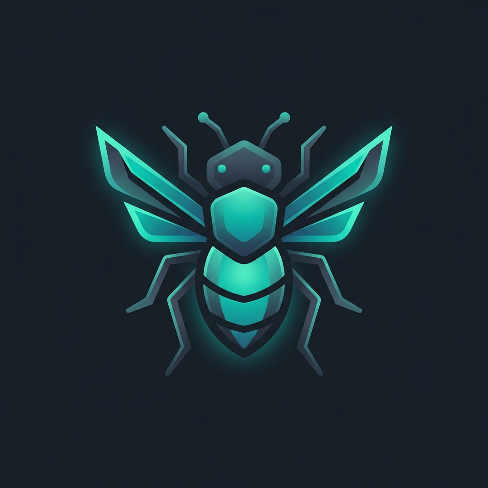

# Bugzilla Model Context Protocol (MCP) Server

<p align="center">
  
</p>

A production-ready Model Context Protocol (MCP) server for integrating Bugzilla with AI agents and LLMs. It enables agents to search, view, create, and update bugs, manage comments, upload attachments, and query metadata directly from a Bugzilla instance.

## Features

- **Authentication:** Supports secure API Key access or anonymous read-only access.
- **Bug Management:** Search, view detailed bug details, create new bugs, and update fields.
- **Comments & Attachments:** Read and add comments, upload attachments as Base64 strings.
- **Metadata Discovery:** Access products, components, fields, and allowed values.
- **npx Support:** Can be executed directly from GitHub without manual build/cloning.

---

## Obtaining a Bugzilla API Key

To authenticate with Bugzilla securely, we recommend using an API Key:
1. Log into your Bugzilla web interface.
2. Go to **User Preferences** (usually by clicking on your email/profile in the top-right corner).
3. Select the **API Keys** tab.
4. Click **Create a New API Key**.
5. Save the generated key. You will pass this key to the MCP server.

---

## Installation & Configuration

You can configure and run this MCP server in one of two ways:

### Method A: Quick Setup via `npx` (Recommended)

This method does not require you to clone or build the project locally. Your AI Client will download and run the built server on-demand from GitHub.

#### 1. Configuration for Antigravity & AI Code Editors
Add the following to your custom agent configs (usually located in `.gemini/config/mcp.json` or your workspace settings):

```json
{
  "mcpServers": {
    "bugzilla": {
      "command": "npx",
      "args": [
        "-y",
        "github:torocruzand/mcp_bugzilla"
      ],
      "env": {
        "BUGZILLA_URL": "https://bugzilla.your-instance.com",
        "BUGZILLA_API_KEY": "your_bugzilla_api_key",
        "BUGZILLA_ALLOW_READ": "true",
        "BUGZILLA_ALLOW_WRITE": "false"
      }
    }
  }
}
```

#### 2. Configuration for Claude Desktop
Add this to your `claude_desktop_config.json` configuration file (typically `~/Library/Application Support/Claude/claude_desktop_config.json` on macOS):

```json
{
  "mcpServers": {
    "bugzilla": {
      "command": "npx",
      "args": [
        "-y",
        "github:torocruzand/mcp_bugzilla"
      ],
      "env": {
        "BUGZILLA_URL": "https://bugzilla.your-instance.com",
        "BUGZILLA_API_KEY": "your_bugzilla_api_key",
        "BUGZILLA_ALLOW_READ": "true",
        "BUGZILLA_ALLOW_WRITE": "false"
      }
    }
  }
}
```

#### 3. Configuration for Claude Code (CLI)
Claude Code manages its MCP server links in user-level configuration settings. You can configure the server by adding the block to your global settings file (typically `~/.claude.json` or `~/.claude/mcp_settings.json`):

```json
{
  "mcpServers": {
    "bugzilla": {
      "command": "npx",
      "args": [
        "-y",
        "github:torocruzand/mcp_bugzilla"
      ],
      "env": {
        "BUGZILLA_URL": "https://bugzilla.your-instance.com",
        "BUGZILLA_API_KEY": "your_bugzilla_api_key",
        "BUGZILLA_ALLOW_READ": "true",
        "BUGZILLA_ALLOW_WRITE": "false"
      }
    }
  }
}
```

#### 4. Configuration for Codex (GUI)
To register this MCP server as a plugin in the Codex app via the graphical user interface:

1. Open the **Plugins** section in the Codex sidebar.
2. Click **Add** > **Add plugin marketplace**.
3. Fill in the modal fields as follows:
   - **Source:** `torocruzand/bugzilla-mcp` (or the full GitHub URL)
   - **Git ref:** `develop` *(IMPORTANT: Set this to `develop` since the repository codebase and manifests reside on the develop branch)*
   - **Sparse paths:** Leave this completely blank (or enter `./`) since the manifest files are at the root of the repository.
4. Click **Add marketplace**, locate the plugin, and click **Install**.
5. Restart the Codex app to apply your changes.

##### Configuring Parameters & API Credentials in Codex
Because the Codex UI does not display custom input fields for plugin environment variables on the installation screen, you must supply your parameters through one of the following methods:

* **Option A: Workspace `.env` File (Recommended)**
  Create a `.env` file in the root of the workspace/project directory you are currently working on in Codex:
  ```env
  BUGZILLA_URL=https://bugzilla.your-instance.com
  BUGZILLA_API_KEY=your_bugzilla_api_key
  BUGZILLA_ALLOW_READ=true
  BUGZILLA_ALLOW_WRITE=false
  ```
  Codex will automatically inject these variables into the plugin process when launched.

* **Option B: Shell Environment Variables**
  Export the credentials in your terminal before launching the Codex application:
  ```bash
  export BUGZILLA_URL="https://bugzilla.your-instance.com"
  export BUGZILLA_API_KEY="your_bugzilla_api_key"
  export BUGZILLA_ALLOW_READ="true"
  export BUGZILLA_ALLOW_WRITE="false"
  # Now start Codex
  codex
  ```

* **Option C: Global Codex Settings File**
  Add the environment variables under the environment/mcp configuration object in your user-level configuration settings file (typically `~/.codex/config.toml` or `~/.claude/settings.json`).

---

### Method B: Manual Setup (Build from Source)

Use this method if you want to run the server from local code or edit its implementation.

#### 1. Clone & Build the Project
```bash
git clone https://github.com/torocruzand/mcp_bugzilla.git
cd mcp_bugzilla
npm install
npm run build
```

#### 2. Configure Environment Variables
Create a `.env` file in the root directory:
```env
BUGZILLA_URL=https://bugzilla.your-instance.com
BUGZILLA_API_KEY=your_bugzilla_api_key

# Permissions (Optional Security Controls)
BUGZILLA_ALLOW_READ=true      # Default is true
BUGZILLA_ALLOW_WRITE=false     # Default is false (set to true to enable creating/updating bugs)
BUGZILLA_ALLOW_DELETE=false    # Default is false
```

#### 3. Client Configuration (Local Source)
Point your client configuration to the built file:

```json
{
  "mcpServers": {
    "bugzilla": {
      "command": "node",
      "args": [
        "/path/to/mcp_bugzilla/build/index.js"
      ],
      "env": {
        "BUGZILLA_URL": "https://bugzilla.your-instance.com",
        "BUGZILLA_API_KEY": "your_bugzilla_api_key"
      }
    }
  }
}
```

---

## Exposed Tools

The server registers and exposes the following tools:

| Tool | Area | Auth | Description |
| :--- | :--- | :--- | :--- |
| `search_bugs` | Bug Management | API Key / Public | Advanced search using parameters: summary, status, assigned_to, product, component, severity, priority, creation_time. |
| `get_bug` | Bug Management | API Key / Public | Retrieve details of a specific bug by ID. Can optionally include `include_history` and `include_attachments`. |
| `create_bug` | Bug Management | API Key | Create a new bug. Requires: product, component, summary, version, and description. |
| `update_bug` | Bug Management | API Key | Modify fields of an existing bug (e.g., status, resolution, assigned_to, priority, severity, summary). |
| `get_comments` | Comments & Attachments | API Key / Public | Retrieve all comments for a specific bug by ID. |
| `add_comment` | Comments & Attachments | API Key | Add a text comment to a bug. Supports optional private comments (`is_private`). |
| `add_attachment` | Comments & Attachments | API Key | Upload a file attachment as a Base64 string with file_name, summary, and content_type. |
| `get_products` | Metadata | API Key / Public | Retrieve the list of products and components available in the Bugzilla instance. |
| `get_fields` | Metadata | API Key / Public | Retrieve active fields, allowed statuses, and resolution values for the instance. |

---

## License

This project is licensed under the MIT License - see the [LICENSE](LICENSE) file for details.
